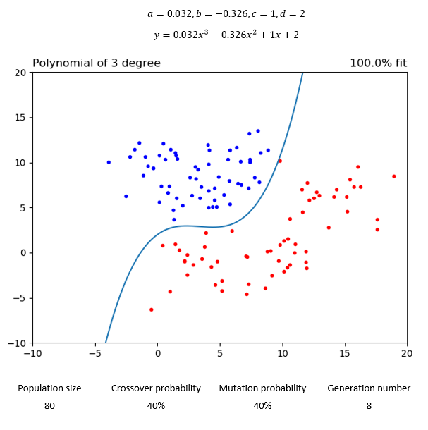
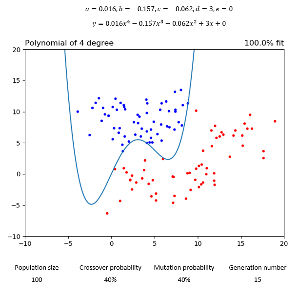
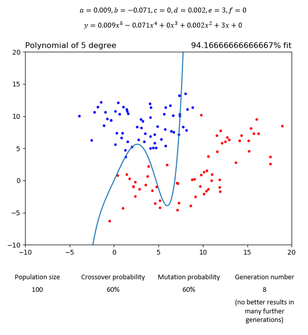

# Finding the best coefficient values of polynomial with the use of Genetic Algorithm

## Table of contents
* [Used technologies](#used-technologies)
* [Problem description](#problem-description)
* [How the algorithm works](#how-the-algorithm-works)
* [Results](#results)
  * [2nd degree polynomial](#2nd-degree-polynomial)
  * [3rd degree polynomial](#3rd-degree-polynomial)
  * [4th degree polynomial](#4th-degree-polynomial)
  * [5th degree polynomial](#5th-degree-polynomial)
	
## Used technologies
* Python
* Numpy
* Matplotlib

## Problem description

There are two sets of points defined in the 2D space: the first is called positive and the second
negative. Let’s assume that positive can be distinguished from negative with the help of a
polynomial curve of a single indeterminate in such a way that elements of the positive set are
located above the curve and the elements of the negative below the curve. The task is to find
values for the coefficients of a curve such that the curve separates positive from negative
points, i.e. we assume that if a point is located above or on the curve it is considered be positive
and negative otherwise.

## How the algorithm works

I have generated sample set of 60 positive and 60 negative points, which should be placed above or below any of the calculated function.

Algorithm steps:
* Initializing of the sample population of function’s parameters (for each function degree different number of parameters are used)
* Setting parameters of the algorithm such as: population size, crossover probability, mutation probability, generation number
* Evaluate initial population with the set size and select its best individuals by sorting them according to fitness function value
* Calculation next fitted populations (as many times as the generation number is):
  * Crossover individuals for next population starting from the best fitted ones with set probability
  * Calculate individuals’ mutations based on set probability
  * Calculate fitness function for each individual
  * Select/sort individuals with the best fitness value

In order to have possibility of obtaining better fitted curves of functions to points I have also implemented floating point number with appropriate conversion for the coefficients of degree 2 and higher.

## Results

### 2nd degree polynomial

### 3rd degree polynomial

### 4th degree polynomial

### 5th degree polynomial

