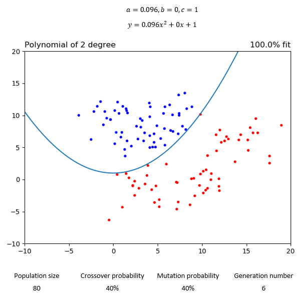
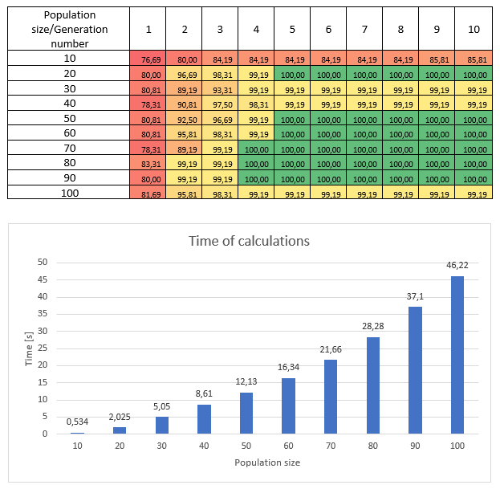

# Finding the best coefficient values of polynomial with the use of Genetic Algorithm

## Table of contents
* [Used technologies](#used-technologies)
* [Problem description](#problem-description)
* [How the algorithm works](#how-the-algorithm-works)
* [Results](#results)
  * [2nd degree polynomial](#2nd-degree-polynomial)
  * [3rd degree polynomial](#3rd-degree-polynomial)
  * [4th degree polynomial](#4th-degree-polynomial)
  * [5th degree polynomial](#5th-degree-polynomial)
* [Test the influence of mutation, crossover and population size with respect to generation number](#test-the-influence-of-mutation-crossover-and-population-size-with-respect-to-generation-number)
  * [2nd degree polynomial test](#2nd-degree-polynomial-test)
  * [3rd degree polynomial test](#3rd-degree-polynomial-test)
  * [4th degree polynomial test](#4th-degree-polynomial-test)
  * [5th degree polynomial test](#5th-degree-polynomial-test)
* [Analysis of obtained tests results, observations and findings](#analysis-of-obtained-tests-results-observations-and-findings)
  * [Function complexity](#function-complexity)
  * [Generation number](#generation-number)
  * [Mutation probability](#mutation-probability)
  * [Crossover probability](#crossover-probability)
  * [Population size](#population-size)

## Used technologies
* Python
* Numpy
* Matplotlib

## Problem description

There are two sets of points defined in the 2D space: the first is called positive and the second
negative. Let’s assume that positive can be distinguished from negative with the help of a
polynomial curve of a single indeterminate in such a way that elements of the positive set are
located above the curve and the elements of the negative below the curve. The task is to find
values for the coefficients of a curve such that the curve separates positive from negative
points, i.e. we assume that if a point is located above or on the curve it is considered be positive
and negative otherwise.

## How the algorithm works

I have generated sample set of 60 positive and 60 negative points, which should be placed above or below any of the calculated function.

Algorithm steps:
* Initializing of the sample population of function’s parameters (for each function degree different number of parameters are used)
* Setting parameters of the algorithm such as: population size, crossover probability, mutation probability, generation number
* Evaluate initial population with the set size and select its best individuals by sorting them according to fitness function value
* Calculation next fitted populations (as many times as the generation number is):
  * Crossover individuals for next population starting from the best fitted ones with set probability
  * Calculate individuals’ mutations based on set probability
  * Calculate fitness function for each individual
  * Select/sort individuals with the best fitness value

In order to have possibility of obtaining better fitted curves of functions to points I have also implemented floating point number with appropriate conversion for the coefficients of degree 2 and higher.

## Results

### 2nd degree polynomial

### 3rd degree polynomial

### 4th degree polynomial

### 5th degree polynomial

## Test the influence of mutation, crossover and population size with respect to generation number

### 2nd degree polynomial test

Test the influence of probability of mutation
* population size: 40
* crossover probability: 40%

Fitness values in %:

Test the influence of probability of crossover
* population size: 40
* mutation probability: 40%

Fitness values in %:

Test the influence of population size
* crossover probability: 40%
* mutation probability: 40%

Fitness values in %:

### 3rd degree polynomial test

Test the influence of probability of mutation
* population size: 40
* crossover probability: 40%

Fitness values in %:

Test the influence of probability of crossover
* population size: 40
* mutation probability: 40%

Fitness values in %:

Test the influence of population size
* crossover probability: 40%
* mutation probability: 40%

Fitness values in %:

### 4th degree polynomial test

Test the influence of probability of mutation
* population size: 40
* crossover probability: 40%

Fitness values in %:

Test the influence of probability of crossover
* population size: 40
* mutation probability: 40%

Fitness values in %:

Test the influence of population size
* crossover probability: 40%
* mutation probability: 40%

Fitness values in %:

### 5th degree polynomial test

Test the influence of probability of mutation
* population size: 40
* crossover probability: 40%

Fitness values in %:

Test the influence of probability of crossover
* population size: 40
* mutation probability: 40%

Fitness values in %:

Test the influence of population size
* crossover probability: 40%
* mutation probability: 40%

Fitness values in %:

## Analysis of obtained tests results, observations and findings

### Function complexity

From this point of view, it can be seen, that as the function complexity increases (degree of the function with the number of parameters needed to calculate), the generation number must increase in order to find required fit. Moreover the more complexity of function requires more difficult equation to be calculated and also requires more irregular form of the function curve to be fitted, with taking into account more generations to be calculated, all these things causes longer time to achieve required fit.

### Generation number

In every test, as number of generation was increasing, the results were more and more fitted. After achieving 100% fit, it would make no sense to proceed with calculations. Unfortunately, in a few situations, the algorithm was not able to find 100% fit, what was caused by no mutation/no crossover at all, or when these probabilities were very small. Similarly, as the mutation probability was approaching 100%, then the mutated population had small amount of individuals, who had retained the better parameters from their parents, so the results were similar as on the starting point in the first generation.

### Mutation probability

In every case, it seems, that the best results are in the median probability point or resembles normal distribution. So, in other words, mutation probability in 20-80% range increases chance to find better fitted function in less time. The computation time as it can be seen, doesn’t change so much with the change of mutation probability, its standard deviation in probability distribution is very low.

### Crossover probability

Crossover probability always seems to lead to better fitness of function in earlier generations as it is higher. Nevertheless, it requires more computation time at the same time. The relation seems to be linear, thus the selection of the optimal probability should take into account each probability result. Rather in most cases the median point, i.e. ~50% will be proper. This computation time, would be reduced if the probability of crossover will decrease with decrease of fitness values. But it would lead to find just local fitness maximum, thus it is also better to cross worse individuals.

### Population size

Similarly as crossover probability, as it is increasing, the fit of function should be achieved earlier. But very serious drawback is that, it increases dramatically the time for calculations, one could see it even as quadratic increase, and thus it is rather impossible to accept. On the other hand vary small population has serious problem in achieving fitness. Therefore, the population size should be chosen as the equilibrium point between smallest generation number required to find fitted function and time of the calculations. Also, it is worth to notice, that with the population size, the crossed population might increase dramatically – it strictly depends on crossover probability. Then from the crossed population the best individuals are chosen, so it is the mystery of “success” of bigger population.

